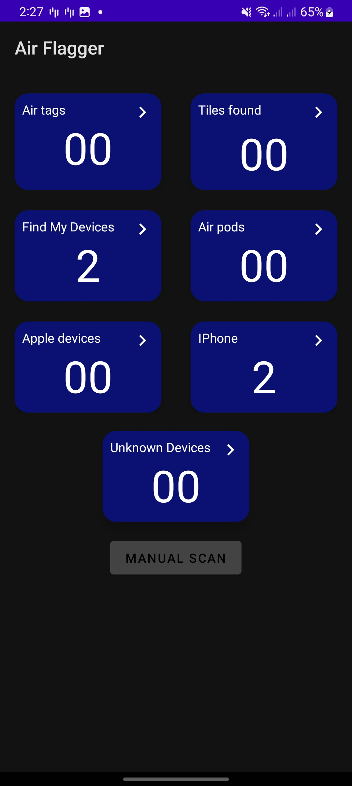
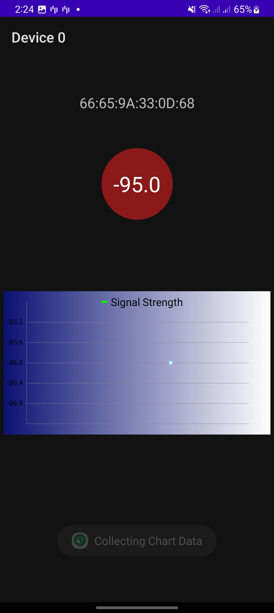

# BLEScanApp

<h1>Bluetooth Low Energy Scan App (AirFlagger)</h1>

under development

Inspired from airguard open source app

Scan for nearby Apple devices and categorize them (Iphone , AirPods , AirTags , Lost Devices)

Other Devices (Tiles , Unknown Apple Devices EX: MacBooks)

Uses Manufacturer Payload Data to scan Devices

Show Signal Strength

SqlLite DB
 
<h1>Future Update :</h1>

AirTags play sound feature

Use MVVM Arch

Increase App performance , Accuracy

# 
# 
# 
